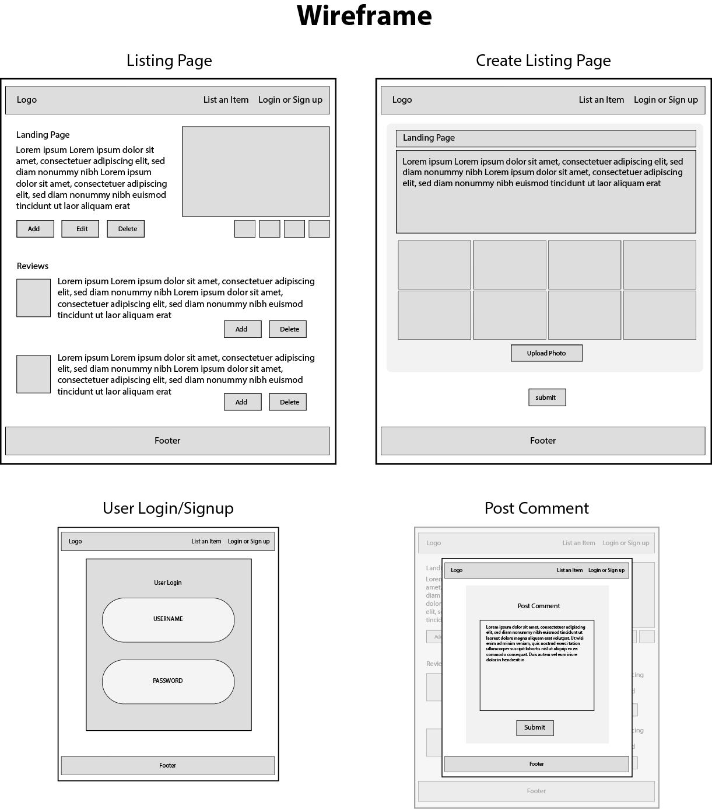
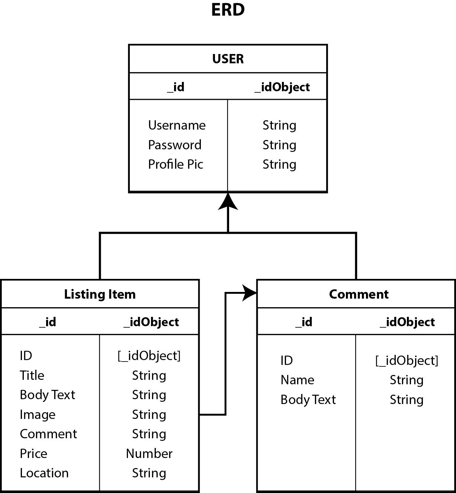

# Project - baro
- https://project-baro.herokuapp.com/

## Rent Based App

Help reduce our environmental footprint by sharing your unused items with everyone! And if you're like me, researching for hours before you buy that next product or want to try that product first before commiting, well look no further, this app might help.

Baro is a renting platform where users can rent or list their personal items. As a logged-in user, you will be able to list any item you want to be rented and name your price for that item. In addition, you will aslo be availabe to leave a review for the items you rented. 

However, as a guest user you can only browse through the app and product listings freely.

## Technologies Used
- HTML
- CSS
- Python
- Django
- Amazon AWS
- Bootstrap
- PostgreSQL
- Git / GitHub

## Features
- Logged-In Users
	- Full Crud on Listing (Model)
	- Full Crud on Posting Review (Model)
	- Upload Photo (Model)
	- User login

## Future Add-Ons
- User Profile
- List Item filtering
- Review Post link to Current User
- Rent Button link to Current User
- Date picker for Rent
- API for location
- Mobile Responsive

## How to get Setup
- python3 -m venv .env
- source .env/bin/activate

## Wireframe & ERD 

## Shout outs
- GA Instructional Team
- GA 1207 Cohortmates
	- Andre Renaud
	- Kenny Trinh
